# R1	
### Answers to all the documentation requirements below.

---

See below

# R2	
### Provide full attribution to referenced sources (where applicable).

---

### Reference list

Codecademy. (n.d.). Learn Python 3: Hello World Cheatsheet. [online] Available at: https://www.codecademy.com/learn/learn-python-3/modules/learn-python3-hello-world/cheatsheet.

indeed. (n.d.). How To Create a Test Plan Template in Excel (Plus Tips). [online] Available at: https://www.indeed.com/career-advice/career-development/test-plan-template-excel [Accessed 22 Dec. 2023].

Loeber’}, {’img’: ’pat_face.webp’}, {’social’: [{’github’: ’https://github.com/patrickloeber’}, {’twitter’: ’https://twitter.com/patloeber’}, {’youtube’: ’https://www.youtube.com/@patloeber’}, {’web’: ’https://patloeber.com/’}, {’linkedin’: ’https://www.linkedin.com/in/patrick-l%C3%B6ber-403022137/’}]}, name’: ’Patrick (n.d.). How to ask the user for input until they give a valid response in Python - Python Engineer. [online] www.python-engineer.com. Available at: https://www.python-engineer.com/posts/ask-user-for-input/.

Programiz.com. (2019). How to get current date and time in Python? [online] Available at: https://www.programiz.com/python-programming/datetime/current-datetime.

Stack Overflow. (n.d.). From the terminal verify if python 3 is installed. [online] Available at: https://stackoverflow.com/questions/38485373/from-the-terminal-verify-if-python-3-is-installed [Accessed 22 Dec. 2023].

Stack Overflow. (n.d.). How can I reject numbers in a string using try except in python? [online] Available at: https://stackoverflow.com/questions/71904806/how-can-i-reject-numbers-in-a-string-using-try-except-in-python [Accessed 22 Dec. 2023].

Stack Overflow. (n.d.). Write date to the top of a CSVFile python. [online] Available at: https://stackoverflow.com/questions/62052693/write-date-to-the-top-of-a-csvfile-python [Accessed 22 Dec. 2023].

w3resource. (2023). Python: Print current time and date. [online] Available at: https://www.w3resource.com/python-exercises/python-basic-exercise-3.php.

W3Schools (2019). Python Tutorial. [online] W3schools.com. Available at: https://www.w3schools.com/python/default.asp.

www.youtube.com. (n.d.). 1: CSV FILES WITH PYTHON - AN INTRODUCTION: How to view, print and search for data in a CSV file. [online] Available at: https://www.youtube.com/watch?v=hCfRE3WHbSc [Accessed 30 Jun. 2023].

www.youtube.com. (n.d.). 4: CSV FILES WITH PYTHON - EDITING A CSV FILE: How to edit a csv file in a user friendly way. [online] Available at: https://www.youtube.com/watch?v=U-jesavovCc [Accessed 22 Aug. 2022].

www.youtube.com. (n.d.). 9.8 CSV File handling: Append the CSV file. Use Python to add more data to the end of the CSV file. [online] Available at: https://www.youtube.com/watch?v=caHoZHgBIPM [Accessed 22 Dec. 2023].

www.youtube.com. (n.d.). Python CSV Module - Reading Files and Skipping Rows. [online] Available at: https://www.youtube.com/watch?v=qrlNypT312I [Accessed 22 Dec. 2023].

www.youtube.com. (n.d.). Python Rich - The BEST way to add Colors, Emojis, Tables and More... [online] Available at: https://www.youtube.com/watch?v=JrGFQp9njas [Accessed 22 Dec. 2023].

# R4	
### Provide a link to your source control repository

---

Git repository can be viewed here: https://github.com/dandotcraig/DanielCraig_T1A3


# R5	
### Identify any code style guide or styling conventions that the application will adhere to. Reference the chosen style guide appropriately.

---

I've decided to go with the PEP8 styling convention. These are the guides I followed: https://peps.python.org/pep-0008/ &  https://pep8.org/

Throughout the project I:
* Never used I, O or single letters as names
* Used underscores to between words if the variable had more than one word within it.
* Aimed to keep max line length at 79 characters 
* Followed the line indentation line break rules
* Only used blank lines inbetween to symbolise a new step
* I updated comments to match the code that had been updated while keeping them short and sweet.
* Avoided white space
* Put once space between various operators

# R6	
### Develop a list of features that will be included in the application. It must include:
- at least THREE features
- describe each feature

Note: Ensure that your features above allow you to demonstrate your understanding of the following language elements and concepts:
- use of variables and the concept of variable scope
- Loops and conditional control structures
- error handling

Consult with your educator to check your features are sufficient 

---

Tutor approval:
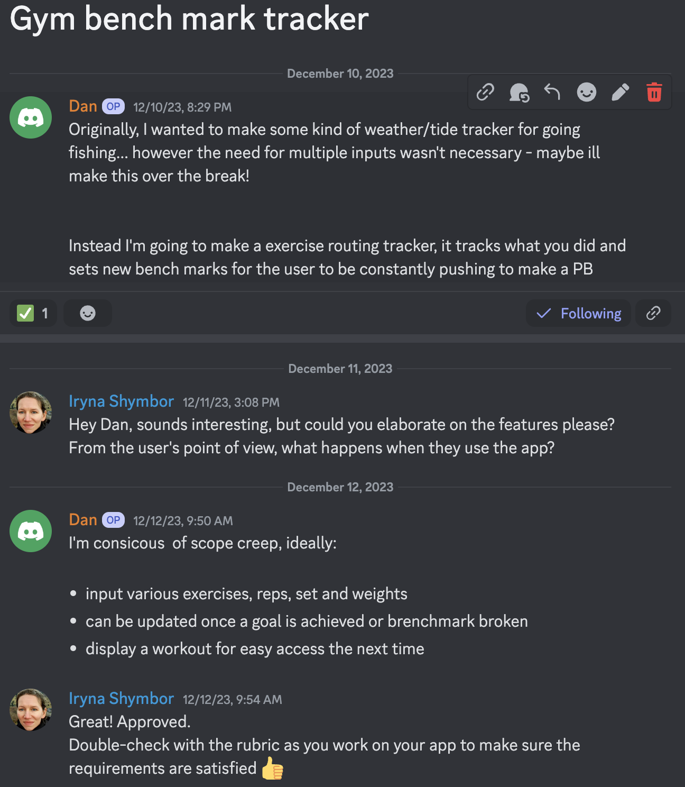

The app has six features:
* View the current workout plan on home creen
* Add a new exercise to the current workout
* Update an exercise in the current workout
* Remove an exercise from the current workout
* View your workout history/workout log since beginning to use the app - this saves workouts with date and time above.
* exit and log your workout in the history/log to be recalled at anytime.

# R7	
### Develop an implementation plan which:
- outlines how each feature will be implemented and a checklist of tasks for each feature
- prioritise the implementation of different features, or checklist items within a feature
- provide a deadline, duration or other time indicator for each feature or checklist/checklist-item
- Utilise a suitable project management platform to track this implementation plan.

Provide screenshots/images that demonstrates your usage of a project management platform used to track this implementation plan. 

Your checklists for each feature should have at least 5 items.

---

For each feature - I used a different card, some cards had checklists for each item I needed to remember, but as a 'solo project manager' I found this to be an easier method, rather than hiding all the things I needed to do within a card.

View the board here: https://trello.com/invite/b/K6SNhpMW/ATTI3d18de177c622e811980ce7e1f6e67a1153CEB2D/danielcraigt1a3

And see the progress shots below:

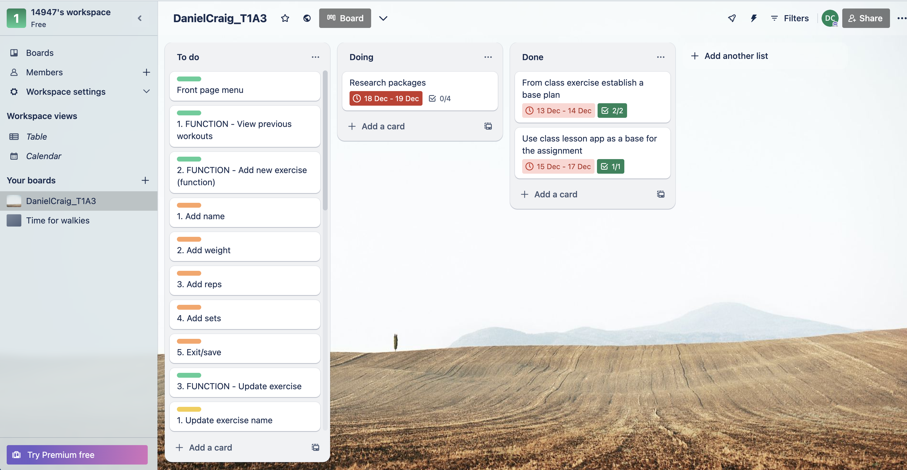 
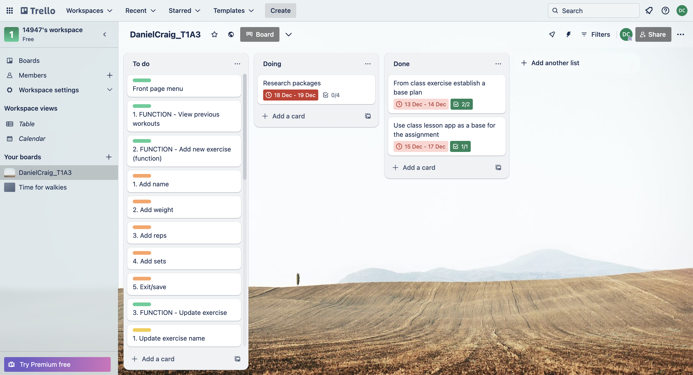 
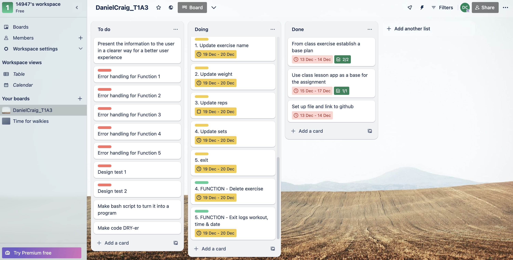 
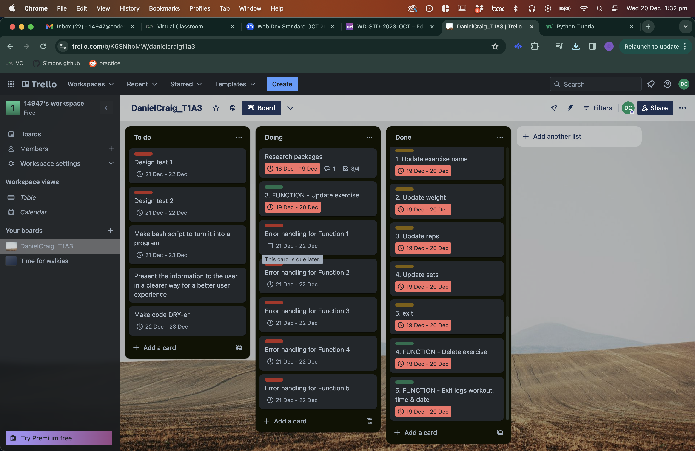 
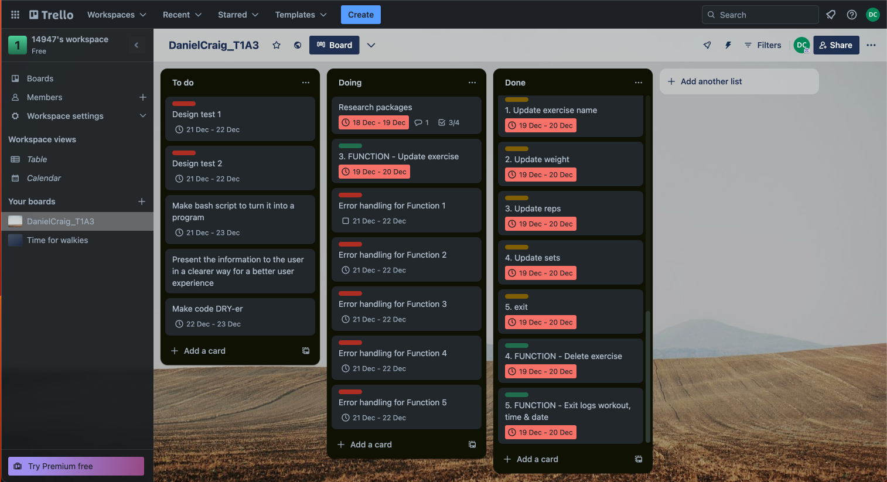 
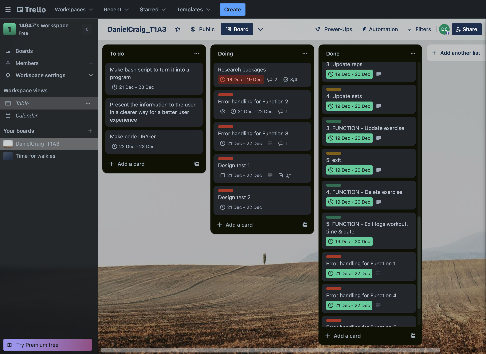 
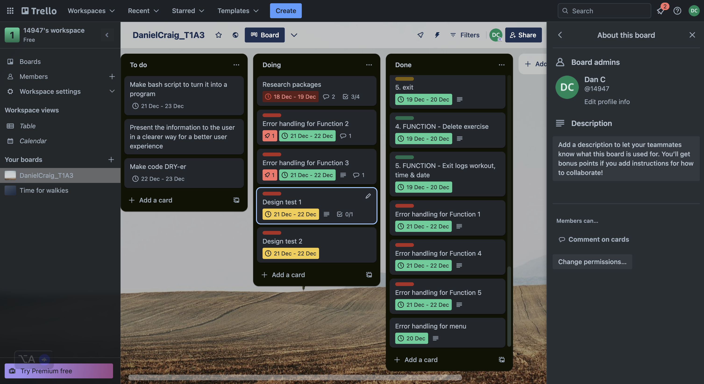 
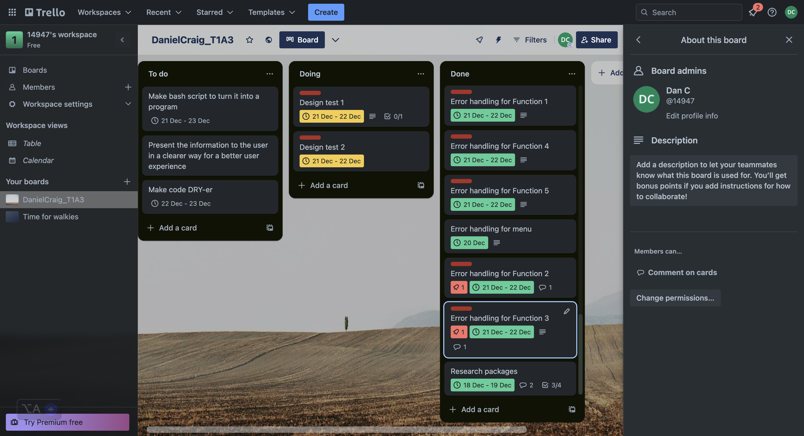 
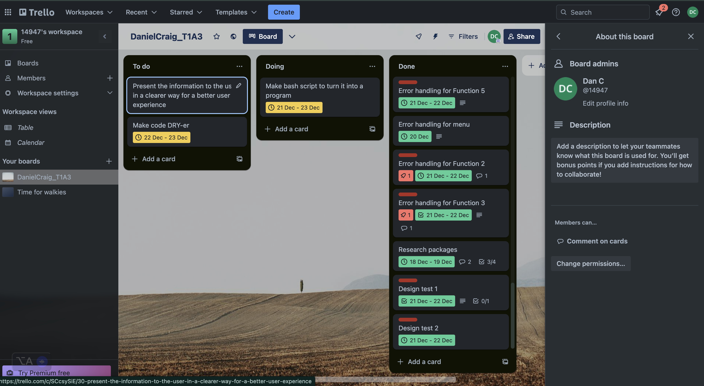


# R8	
### Design help documentation which includes a set of instructions which accurately describe how to use and install the application.You must include:
- steps to install the application
- any dependencies required by the application to operate
- any system/hardware requirements
- how to use any command line arguments made for the application

---

### Steps

I have developed a script called [Run](run.sh), and it is designed to be opened within the terminal. First, the user must have navigated to the file of the run (hint - On Mac, the user can drag the file from Finder into the terminal, press enter, and the user will be within the required file). Then, you need to type 'bash run.sh' and enter. The file should then go through, open in a virtual environment, install the required packages, and then open the program.

Simply put:
* On Mac, drag the app's file into terminal to insure the user in within the folder structure.
* Type:
```bash
bash run.sh
```
* Press enter
* The app should now be opem, and the user is presented with 5 options.
* If it is the user first time, they will need to start to add workouts to their list, they can do this by entering 1 and following the prompts.

### Dependencies

Attached is a requirements.txt, which has the following requirements and dependencies to run the app:
* DateTime==5.4
* emoji==2.9.0
* iniconfig==2.0.0
* markdown-it-py==3.0.0
* mdurl==0.1.2
* packaging==23.2
* pluggy==1.3.0
* Pygments==2.17.2
* pytest==7.4.3
* pytz==2023.3.post1
* rich==13.7.0
* zope.interface==6.1

### System and hardware requirements:

Python requirements:
* Python 3.7 or newer

Package requirements:
* Datetime (version 5.4)
* emoji (version 2.9.0)
* Rich (version 13.7.0)

Software requirements:
* Windows 10 or newer
* macOS 10.12 or newer
* Linux with kernel version X or newer

Hardware requirements:
* Any modern computer or laptop with at least 2GB RAM and 100MB of free disk space.


# R9 & R10
---

I've created an overview video here: https://youtu.be/FbKd6TzjVw4?feature=shared
Slide deck can be viewed here: [DanielCraig_T1A3_slidedeck](img/DanielCraig_T1A3_slidedeck.pdf)
Slide deck video can viewed here: https://youtu.be/MUvIY0AUXLA?feature=shared


# R11	
### Implement features in the software development plan you have designed.

---

See thee [Main](main.py) & [Functions](gym_functions.py) python folder

# R12	
### Apply DRY (Don’t Repeat Yourself) coding principles to all code produced.

---

See thee [Main](main.py) & [Functions](gym_functions.py) python folder

# R13	
### Apply all style and conventions for the programming language consistently to all code produced.

---

See thee [Main](main.py) & [Functions](gym_functions.py) python folder

# R14	
### Creates an application which runs without error and has features that are consistent with the development plan.


---

Scroll to R8 to run the program.

# R15
### Design TWO tests which check that the application is running as expected.


---

Design and implimented over 20 tests

[Worksheet test CSV]() 

[Worksheet test PDF]()

View example below:

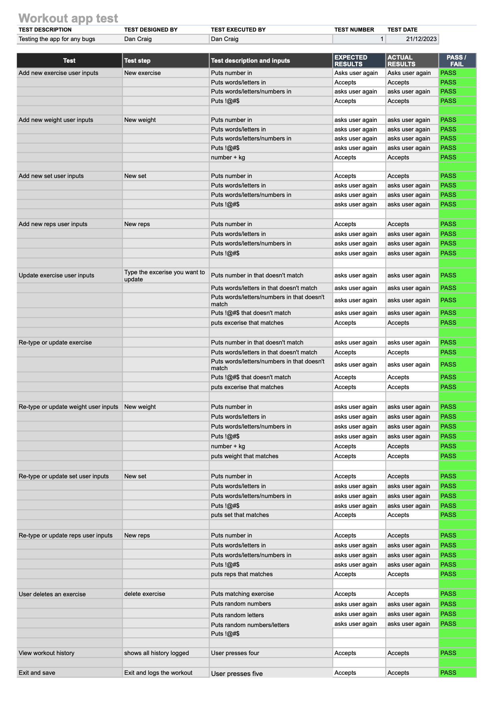

# R16
### Utilise source control throughout the development of the application

---

At the time of writing this, I've commited to git hub over 43 times. 

https://github.com/dandotcraig/DanielCraig_T1A3

View example below:

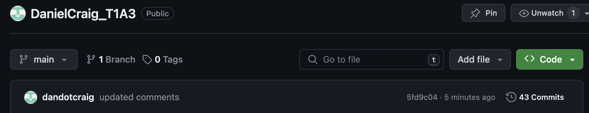

# R17
### Utilise developer tools to facilitate the execution of the application

---

View [Run.sh](run.sh)